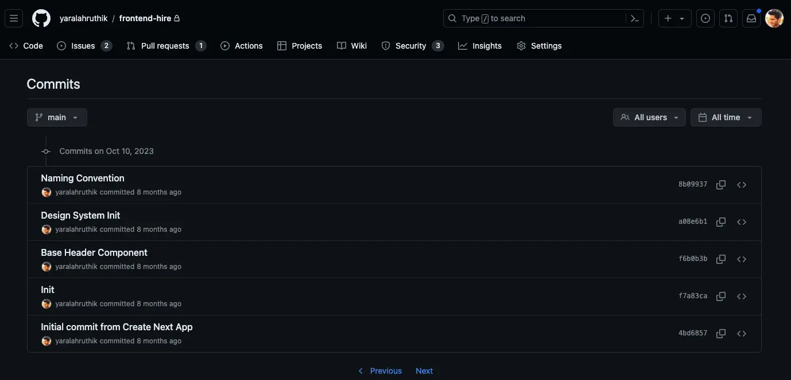

This is the first major update to the platform. It has been almost **9 months** since I started Frontend Hire. Of which only **4 months** have been the part where I took it **seriously**.

## The Start

To be honest, I did not start Frontend Hire with any serious intention. I was just exploring a new technology and thought it would make a nice coding workspace for learning purposes. This was also when I was mentoring (more like talking) new people on [Topmate](https://topmate.io/iamyhr).

This is where I realized the amount of skill gap some of these people had despite having a lot of experience on paper. They were struggling to get and clear the interviews. I'll be honest, the current interview process is shitty, does not tell anything about the candidate. But the quantity of candidates means a standard procedure to hire them usually works.

So, where is the issue? The issue comes when most of these folks who got hired end up working on the same stuff for months and sometimes years and they have not solved a lot of **distinct** problems.

> Experience is not about the number of years. It is about the number of distinct problems solved.

Okay, I agree that not everyone can have the luxury of being on a team that solves good problems. There has to be another way to gain this experience. Yes, there is! That is what platforms like **Frontend Hire** are all about. The power of education is what makes such platforms grow. Everyone has a different way to teach. Everyone has a different way to learn. The compatibility makes it possible to learn from each other.

## Taking It Seriously

Back in 2022, I started a small product called **"Pages From My Diary"**, it was basically a minimal, private journaling app. It was meant to solve my problem and I thought others would also use it. But none used it and I abandoned the project soon.

But with Frontend Hire, the amount of traction an educational product could bring has surprised me. Without much effort, I have been able to grow to **1100+** registered users (Google Verified Accounts), **5000+** followers on [LinkedIn](https://www.linkedin.com/company/frontend-hire/), and some growth on [Twitter](https://twitter.com/frontendhire), [YouTube](https://www.youtube.com/@FrontendHire), and [Instagram](https://www.instagram.com/frontendhire/).

This meant I could take it seriously. I still do not work full-time on it but would definitely love to work on such educational products full-time.

So, I started the legal stuff and launched [Pro Plan](https://www.frontendhire.com/pricing) and also made a few sales. So, is that the major update?

## The Major Update

When I started Frontend Hire, I was not serious and pushed stuff without much thought towards monetization. But now I am serious and want to push the potential growth of Frontend Hire. 

**This means I have to make the following decisions as a small team (literally me pushing 99% of the stuff at the moment):**

### Limited Free Stuff

- The questions were initially meant to be free for everyone but this is the content that I can grow easily and better monetize.

- Some of the questions (the ones that use Node.js runtime) would require me to have a commercial license (which can get quite expensive). Luckily, the CodeSandbox team gave me a one-year free license given the early stage of the company.

The above two reasons are why **Questions** won't be free access anymore (only a few of them will be). I will still be pushing free stuff but only on [YouTube](https://www.youtube.com/@FrontendHire) to grow the channel.

### Deprecating Projects

- I had high hopes for this but it never made much impact. Maybe it was my execution, and I might come to it in the future. But for now, I will be removing **Projects** from the platform.

- In my opinion, courses are better serving the purpose of learning and that is the direction I am pushing the platform.

The above three reasons are why **Projects** will be removed from the platform.

### Thoughts On Hiring Profiles

- All my research suggests there is no good way to solve the hiring problem. The current trends point towards a scouting style of hiring. This is how some of the best engineers are getting hired with literal social proof of work.

- But for the majority of the folks this can be a distant dream. I am clueless about how to solve it for these folks and this is and should be anyone's target audience. I do not want to push another product where you just do a bunch of steps, solve routine problems, and be listed on the platform. 

The above two reasons are why **Hiring Profiles** will be not pushed anytime soon.

## Final Thoughts

This was the major update I wanted to share with you. All the decisions are meant to better serve the purpose of Frontend Hire.

Thanks for being part of this journey. It would not have been possible without you.

Thanks

Hruthik Reddy