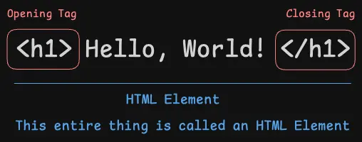
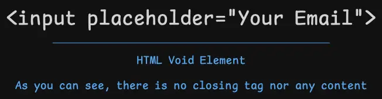

import { Callout } from '@/components/MarkdownComponents';

export const meta = {
  lastUpdated: '2024-08-15'
}

# What is HTML?

<Callout type='error'>
Again, this is a practical course and you can read more about the history in the [further reading](#further-reading).
</Callout>

To keep it simple, HTML is nothing but a text document with some kind of special format. Just the way you create Microsoft Word documents or Google Docs, we do something special for web browsers.

An HTML page or document is made up of many HTML Elements. These elements are made up of HTML tags.

**Example of an HTML Element:**

The majority of the elements in HTML will have an opening tag and a closing tag. Some elements do not have a closing tag or any content and would look like this:

We call such an element with no closing tag `Void Elements`.

There are a lot of these elements like `<h1>`, `
`, `<ul>`, `<li>`, etc. We will cover the most common elements in this cohort. Anything that is not covered can easily be looked up on the web.

## Things to Remember

- HTML Tags are lowercase and enclosed in angle brackets.
- HTML Opening Tag is `< >` and HTML Closing Tag is `</ >`.
- HTML Void Elements do not have closing tags or any content.

<Callout type='error'>
HTML is very forgiving and in case you make any mistake, it will still work but with unexpected results.
</Callout>

## Further Reading

- [Wikipedia: HTML](https://en.wikipedia.org/wiki/HTML)