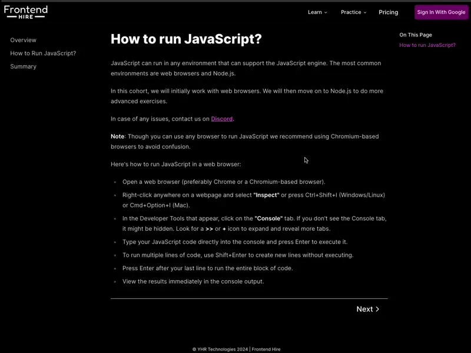

import { Callout, CustomCodeViewer } from '@/components/MarkdownComponents';
import HowToRunJavaScript from './examples/how-to-run-javascript';

export const meta = {
  lastUpdated: '2024-07-25'
}

# How to run JavaScript?

JavaScript can run in any environment that can support the JavaScript engine. The most common environments are web browsers and Node.js.

In this cohort, we will initially work with web browsers. We will then move on to Node.js to do more advanced exercises.

**Note**: Though you can use any browser to run JavaScript we recommend using Chromium-based browsers to avoid confusion.

## Method 1: Open the Developer Tools

This method is ideal for quick exercises.

Here's how to run JavaScript in a web browser:
1. Open a web browser (preferably Chrome or a Chromium-based browser).
2. Right-click anywhere on a webpage and select **"Inspect"** or press Ctrl+Shift+I (Windows/Linux) or Cmd+Option+I (Mac).
3. In the Developer Tools that appear, click on the **"Console"** tab. If you don't see the Console tab, it might be hidden. Look for a **>>** or **+** icon to expand and reveal more tabs.
4. Type your JavaScript code directly into the console and press Enter to execute it.
5. To run multiple lines of code, use Shift+Enter to create new lines without executing.
6. Press Enter after your last line to run the entire block of code.
7. View the results immediately in the console output.

You can test by running the following code:

```js
console.log("Hello, World!");
```



## Method 2: Create an HTML file and run it in the browser

This is how the majority of web applications run the JavaScript files.

1. Open a text editor (like Notepad, Visual Studio Code, or any code editor of your choice).
2. Create a new file and save it with a .html extension (e.g., index.html).
3. Add the following basic HTML structure to your file:

```html showLineNumbers {13-15} 
<!DOCTYPE html>
<html>

<head>
  <title>Parcel Sandbox</title>
  <meta charset="UTF-8" />
  <link rel="stylesheet" href="/styles.css" />
</head>

<body>
  <h1>Hello world</h1>

  <script>
    console.log("hello world!");
  </script>
</body>

</html>
```

4. Save the file.
5. Open the HTML file in your web browser by double-clicking it or dragging it into an open browser window.
6. Right-click and select "Inspect" to open the Developer Tools, then go to the Console tab to see the output.

Alternatively, you can link an external JavaScript file:

1. Create a separate file with a .js extension (e.g., script.js).
2. In your HTML file, replace the \<script\> tag content with:

```html
<script src="script.js"></script>
```

3. Make sure both files are in the same directory and open the HTML file in your browser.

## Method 3: Run it in Node.js

Node.js allows you to run JavaScript outside of a web browser, directly on your computer.

1. First, install Node.js from the official website.
2. Open a text editor and create a new file with a .js extension (e.g., example.js).
3. Add your JavaScript code to this file. For example:

```js
console.log("Hello, World!");
```

4. Save the file.
5. Open a terminal or command prompt.
6. Navigate to the directory containing your JavaScript file using the cd command.
7. Run the script by typing:

```sh
node example.js
```

8. You should see the output in your terminal.

## Interactive Exercises

So, you saw the different methods to run JavaScript. We want to make it a bit easier for you to learn. So, you will find interactive code sandboxes like the one below to work on.

This sandbox auto-reloads when you make changes, so do not worry if you see something run repeatedly, just clear the console and and make a change.

Try a small exercise:

- From one of the above examples, figure out how to run JavaScript in the below sandbox.
- Log to the console "Hello, World!".

**Note:** The work you do in the sandbox will not be saved! We will worry about saving stuff the good way later by learning the basics of Git.

<HowToRunJavaScript />

<Callout>
Do you think we need all that extra code to run JavaScript in the sandbox? Why don't you try to run just the below code in the sandbox?

<CustomCodeViewer>
```html
<!-- index.html -->
<script>
  console.log("Hello, World!");
</script>
```
</CustomCodeViewer>

Well, the answer is you do not need any of that extra code. But it is quite rare to not have additional code in real-world applications. We will cover that later in the cohort.
</Callout>

In case of any issues, contact us on [Discord](https://discord.gg/DWAVqksVtx).

## Further Reading

- [Code Editors](https://javascript.info/code-editors)
- [Dev Tools](https://javascript.info/devtools)
- [Hello World](https://javascript.info/hello-world)