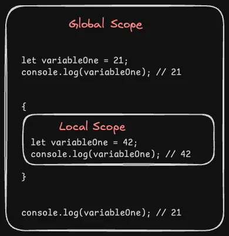

import { Callout } from '@/components/MarkdownComponents';

export const meta = {
  lastUpdated: '2024-08-02'
}

# Variables

<Callout type='error'>
From now on, we will be talking a lot about JavaScript syntax. One thing that we won't discuss is semicolons. 

Even though semicolons are not mandatory in JavaScript. The convention agreed on by the majority of the JavaScript developers is to use them. 

**SO USE SEMICOLONS TO END A JAVASCRIPT STATEMENT**
</Callout>

How do you store something in your code that you want to use again later? Well in almost all programming languages, you do that with variables.

<Callout>
Interview Question: Where does the JavaScript Engine store the variables?

**Answer: The JavaScript engine stores the variables in a heap.**
</Callout>

In JavaScript, you can declare variables in three ways:

## 1. Using `let`

The `let` keyword is used to declare variables that can be reassigned.

Here are a few examples of using `let`:

```js
// Declare a variable without initializing it
let variableDeclared;

// Declare a variable as well as initialize it
let variableDeclaredAndInitialized = 21;

// Assign a value to a previously declared variable
variableDeclared = 'value assigned now';

/*
Variables can be reassigned to any data type
not a good idea but JavaScript won't complain
but your fellow developers will
*/ 
variableDeclaredAndInitialized = 'reassigned the value';
```

### Common Mistakes

**You cannot create another variable with the same name within the same scope.**

The below example will throw an error:

```js
let variableOne = 21;

// Attempt to redeclare a variable
let variableOne = 42; // Uncaught SyntaxError: Identifier 'variableOne' has already been declared
```

But the below example will not throw an error:

```js
let variableOne = 21;
console.log(variableOne); // 21

{
  let variableOne = 42;
  console.log(variableOne); // 42
}

console.log(variableOne); // 21
```

**Even this won't throw an error but see how the output is different:**

```js
let variableOne = 21;
console.log(variableOne); // 21

{
  variableOne = 42;
  console.log(variableOne); // 42
}

console.log(variableOne); // 42
```

<Callout type="warning">
We will discuss more about the scope later in the cohort. But for now, just remember that `curly braces {}` creates a new scope and that there is a default global scope.


</Callout>

**Trying to access the same variable before it has been declared will throw an error:**

```js
let variableOne = 21;
console.log(variableOne); // 21
 
{
  console.log(variableOne); // Uncaught ReferenceError: Cannot access 'variableOne' before initialization
  let variableOne = 42;
  console.log(variableOne); // Won't log due to ReferenceError
}
 
console.log(variableOne); // Won't log due to ReferenceError
```

But something like this will not throw an error:

```js
let variableOne = 21;
console.log(variableOne); // 21
 
{
  console.log(variableOne); // 21
  let variableTwo = 42;
  console.log(variableTwo); // 42
}
 
console.log(variableOne); // 21
```

**Trying to access a variable that is out of scope will throw an error:**

```js
let variableOne = 21;
console.log(variableOne); // 21
 
{
  console.log(variableOne); // 21
  let variableTwo = 42;
  console.log(variableTwo); // 42
}
 
console.log(variableOne); // 21
console.log(variableTwo); // Uncaught ReferenceError: variableTwo is not defined
```

## 2. Using `const`

The `const` keyword is used to declare variables that cannot be reassigned.

```js
// Basic constant declaration
const localConstant = 'can never take another value';

/*
Global constant declaration 
nothing different than basic constant declaration
except the naming convention tells developers that it is global
*/
const GLOBAL_CONSTANT = 'global constant';

const PI = 3.14;
```

### Common Mistakes

**Note: Variable rules are almost consistent. So, the above mistakes that apply to `let` also apply to `const`.**

**You can't reassign a constant.**

The below example will throw an error:

```js
const PI = 3.14;
// Attempt to reassign a constant
PI = 3.14159; // Uncaught TypeError: Assignment to constant variable.

{
  // This will also throw an error, REASSIGNING A CONSTANT IS A BIG NO!
  PI = 3.14159; // Uncaught TypeError: Assignment to constant variable.
}
```

## 3. Using `var`

<Callout type='error'>
This is optional to learn in our opinion and can be learned when you need it! We just do **not** recommend using `var` at all. Some might disagree with us. Learn it now if you want or feel free to skip this section and move on to [Variable Naming Rules](#variable-naming-rules).
</Callout>

You can say that `var` and `let` behave similarly in most cases. In general, avoid using `var` at all. It just can be confusing. Some of the cases that caused errors with `let` do **not** apply to `var`.

**You can create another variable with the same name in the same scope.**

```js
let variableOne = 21;
 
// Attempt to redeclare a variable
let variableOne = 42; // NO ERROR THIS TIME

console.log(variableOne); // 42
```

This means there are some weird behaviors with `var`.

```js
var variableOne = 21;
console.log(variableOne); // 21
 
{
  var variableOne = 42;
  console.log(variableOne); // 42
}
 
console.log(variableOne); // 42, in the case of let, this would have been 21
```

**Basically, with `var` the block scope does not matter.**

There is also something called `hoisting`. Something commonly asked about in interviews.

**Hoisting is just raising the variable to the top of the scope.**

```js
variableOne = 21;

var variableOne;

console.log(variableOne); // 21
```

But it can still be weird:

```js
variableOne = 21;

var variableOne = 42;

console.log(variableOne); // 42
```

There is more weird stuff with `var`. You can search the internet for more. We do not care about it.

## Variable Naming Rules

Great, you learned how to declare and initialize variables. But there is something more you have to learn. 

**Naming these variables right!**

You cannot name them whatever you want. There are some rules that you have to follow:

**The name must contain only letters, digits, or the symbols $ and _.**

```js
let variable = 42;

let variable1 = 42;

let _variable = 42;

let $variable = 42;

// All of the below will throw an error

// Uncaught SyntaxError: Unexpected identifier 'one'
let variable one = 42;

// Uncaught SyntaxError: Unexpected token '&'
let variable&one = 42;

// Uncaught SyntaxError: Unexpected number
let variable 1 = 42
```

Also, avoid using symbols and _ unless you know what you are doing (you'll know later in the cohort).

**The first character must not be a digit.**

```js
// Uncaught SyntaxError: Invalid or unexpected token
let 1variable = 42;
```

**You cannot use reserved words as variable names.**

There are a [few words that are reserved](https://developer.mozilla.org/en-US/docs/Web/JavaScript/Reference/Lexical_grammar#keywords) by the JavaScript language. You will learn about most of these words in this cohort. For now, understand that you cannot use reserved words as variable names.

Example:

```js
// Uncaught SyntaxError: let is disallowed as a lexically bound name
let let = 42;

// Uncaught SyntaxError: Unexpected token 'const'
const const = 42; 

// Similarly, you cannot do the below too

// Uncaught SyntaxError: Unexpected token 'const'
let const = 42; 

// Uncaught SyntaxError: let is disallowed as a lexically bound name
const let = 42; 
```

## Good Naming

Now, naming things good is quite difficult. But if you do name them well, you will see huge benefits when reading the code later. 

There are no rules here to teach. In all of the exercises, we will use good naming. So, you can use that as a reference. We will have quick exercises in the next section.

**Also, have you noticed a few things?**

As JavaScript developers, we conventionally use **camelCase** for variable names. That is when multiple words are combined to form a single name, we differentiate them with capital letters except the first word. This is called **camelCase**.

Additionally, when naming global constants we use **UPPERCASE**. But when there are multiple words, we use **UPPERCASE_COLORS** with an underscore between them. Just to make it easier to read.

## Further Reading

- [MDN Docs: Variables](https://developer.mozilla.org/en-US/docs/Learn/JavaScript/First_steps/Variables)
- [JavaScript Info: Variables](https://javascript.info/variables)
- [JavaScript Info: Var](https://javascript.info/var)