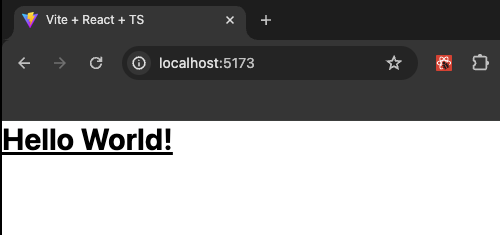

import { CustomCodeViewer } from '@/components/MarkdownComponents';

# Project Setup

In this guide, we will not cover the initial setup of the project. But we followed the same steps as those covered in our other course.

We have created a GitHub repository with the initial setup to make it easier for you. You can fork or clone the [repository](https://github.com/Frontend-Hire/stackpack-webcontainers-react-typescript) and start working on the project. The branch should be `0-start`.

<CustomCodeViewer>
```bash
git clone https://github.com/Frontend-Hire/stackpack-webcontainers-react-typescript.git
```
</CustomCodeViewer>

Then run the following commands:

<CustomCodeViewer>
```bash
cd stackpack-webcontainers-react-typescript
npm install
```
</CustomCodeViewer>

If you want to do this manually, check out the project setup in the course: [Todo App with React, TypeScript, and TDD](/todo-app/react/project-setup)

## Tailwind CSS

We will use Tailwind CSS to style our application. This course is not a Tailwind CSS course, so I will not cover the basics of Tailwind CSS. We recommend checking out the [official documentation](https://tailwindcss.com/docs/installation) if you are new to Tailwind CSS.

However, we will cover the setup and usage of Tailwind CSS for our project. The setup is straightforward, and we follow the [official documentation's install steps for Vite](https://tailwindcss.com/docs/guides/vite).

### Installing Tailwind CSS

<CustomCodeViewer>
```bash
npm install -D tailwindcss postcss autoprefixer
npx tailwindcss init -p
```
</CustomCodeViewer>

This step will create a `tailwind.config.js` and a `postcss.config.js` file at the root of our project.

Next, we need to update our `tailwind.config.js` file with the following content:

<CustomCodeViewer filename="tailwind.config.js">
```js showLineNumbers
/** @type {import('tailwindcss').Config} */
export default {
  content: ['./index.html', './src/**/*.{js,ts,jsx,tsx}'],
  theme: {
    extend: {},
  },
  plugins: [],
};
```
</CustomCodeViewer>

We must set up the Tailwind directives in our global CSS file, `src/index.css`

<CustomCodeViewer filename="src/index.css">
```css showLineNumbers
@tailwind base;
@tailwind components;
@tailwind utilities;
```
</CustomCodeViewer>

Let us run the dev server.

<CustomCodeViewer>
```bash
npm run dev
```
</CustomCodeViewer>

Make a slight change in the `src/App.tsx` file to see if Tailwind CSS works.

<CustomCodeViewer filename="src/App.tsx">
```tsx showLineNumbers {2}
export default function App() {
  return <div className='text-3xl font-bold underline'>Hello World!</div>;
}
```
</CustomCodeViewer>

We should see the following output in the browser.



### Editor Setup for Tailwind CSS

We recommend setting up a few editor extensions to make working with Tailwind CSS easier.

1. [**Tailwind CSS IntelliSense**](https://marketplace.visualstudio.com/items?itemName=bradlc.vscode-tailwindcss): This extension provides IntelliSense for Tailwind CSS in your editor. A must-have extension for working with Tailwind CSS.

2. [**Inline-fold**](https://marketplace.visualstudio.com/items?itemName=moalamri.inline-fold) (Optional): This extension allows you to fold the Tailwind CSS classes in your editor. This helps to avoid bloating the editor with a lot of classes.

### Prettier Plugin to sort Tailwind CSS classes

We recommend using the [Official Prettier Plugin](https://tailwindcss.com/docs/editor-setup#automatic-class-sorting-with-prettier) to sort the Tailwind CSS classes in your editor. This plugin dramatically reduces the cognitive load of working with the classes.

Install the plugin:

<CustomCodeViewer>
```bash
npm install -D prettier-plugin-tailwindcss
```
</CustomCodeViewer>

Add the plugin to your `.prettierrc` file:

<CustomCodeViewer filename=".prettierrc">
```json showLineNumbers {7}
{
  "trailingComma": "all",
  "tabWidth": 2,
  "semi": true,
  "singleQuote": true,
  "printWidth": 80,
  "plugins": ["prettier-plugin-tailwindcss"]
}
```
</CustomCodeViewer>

Great, this wraps up this section. We have a decent project setup to start working on our application.

At this point, our code should match the code in the branch [`1-project-setup`](https://github.com/Frontend-Hire/stackpack-webcontainers-react-typescript/tree/1-project-setup).
