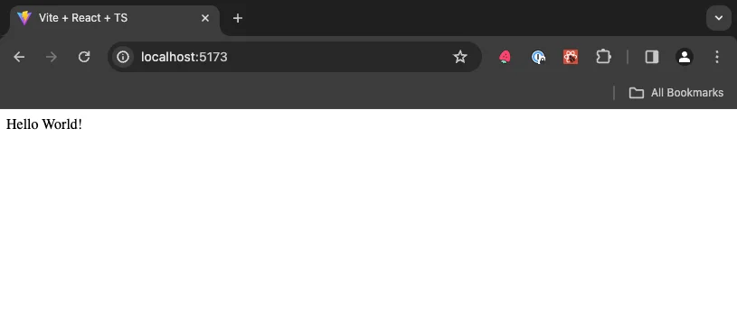

import { Steps, Callout, CustomCodeViewer } from '@/components/MarkdownComponents';

export const meta = {
  lastUpdated: '2024-02-29',
};

# Project Setup

<iframe
  width='100%'
  style={{
    aspectRatio: '16 / 9',
  }}
  src='https://www.youtube.com/embed/ceoqAy8nFNE?si=TyvaA1d-nKCYDS2D'
  title='Introduction and Project Setup | Todo App with React, TypeScript, TDD | Frontend Hire'
  frameBorder='0'
  allow='accelerometer; autoplay; clipboard-write; encrypted-media; gyroscope; picture-in-picture; web-share'
  allowFullScreen
/>

<Steps>
### Vite + React + TypeScript
 
We will use the Vite template with React and TypeScript as our starting point. To get started, run the following command in your terminal:

<CustomCodeViewer>
```sh
npm create vite@latest todo-app -- --template react-ts
```
</CustomCodeViewer>

Then, navigate to the project directory and install the dependencies.

<CustomCodeViewer>
```sh
cd todo-app
npm install
```
</CustomCodeViewer>

Read more about scaffolding a Vite project [here](https://vitejs.dev/guide/#scaffolding-your-first-vite-project).

### Git

Who doesn't use Git these days? We will use Git to manage our code versioning.

To initialize a Git repository, run the following command in your terminal:

<CustomCodeViewer>
```sh
git init
```
</CustomCodeViewer>

### Prettier: The Opinionated Code Formatter

<Callout>
  Why should we even care about formatting our code? Having a consistent code style across your project is a good practice. It makes it easier for
  other developers to read and understand your code. It also makes it easier to
  spot errors and bugs.
</Callout>

We pretty much follow the same install instructions from the [Prettier Docs](https://prettier.io/docs/en/install).

Prettier is not just used as a VSCode extension but also as a CLI tool to format your code. We will use it to format our code before committing it to Git. To install it, run the following command in your terminal:

<CustomCodeViewer>
```sh
npm install --save-dev --save-exact prettier
```
</CustomCodeViewer>

Then, create an empty config file.

<CustomCodeViewer>
```sh
node --eval "fs.writeFileSync('.prettierrc','{}\n')"
```
</CustomCodeViewer>

And add the following to it. Feel free to change the values to your liking (this is what I prefer):

<CustomCodeViewer>
```json
{
  "trailingComma": "all",
  "tabWidth": 2,
  "semi": true,
  "singleQuote": true,
  "printWidth": 80
}
```
</CustomCodeViewer>

We also want to **not** format specific files. This project would not have such files, but creating one is still a good idea. Create a `.prettierignore` file and add the following:

<CustomCodeViewer>
```sh
# Ignore artifacts:
build
coverage
```
</CustomCodeViewer>

We can now format all files in our project by running the following command in our terminal:

<CustomCodeViewer>
```sh
npx prettier . --write
```
</CustomCodeViewer>

### Prettier: Editor Integration

We assume that you are using VSCode as your editor. If not, you can still follow along but you will have to figure out how to integrate Prettier with your editor. Guide for other editors can be found [here](https://prettier.io/docs/en/editors).

Install the Prettier extension for VSCode. You can find it [here](https://marketplace.visualstudio.com/items?itemName=esbenp.prettier-vscode).

We want to use Prettier as the default formatter and format our code automatically when we save a file. To do this, we need to add the following to our VSCode settings:

<CustomCodeViewer>
```json
"editor.defaultFormatter": "esbenp.prettier-vscode",
"editor.formatOnSave": true
```
</CustomCodeViewer>

You can also do this through the UI. Open the VSCode settings and search for `formatOnSave`. Check the box to enable it. Then, search for `defaultFormatter` and select `esbenp.prettier-vscode`.

### ESLint

ESLint is a tool for finding and fixing bugs in our JavaScript code. It also helps us to enforce code style and formatting conventions. Vite template already comes with ESLint installed.

Since the formatting rules sometimes conflict with Prettier, we will use the [eslint-config-prettier](https://github.com/prettier/eslint-config-prettier#installation) to handle these conflicts.

To install it, run the following command in your terminal:

<CustomCodeViewer>
```sh
npm install --save-dev eslint-config-prettier
```
</CustomCodeViewer>

Then, update your `.eslintrc.*` file to extend the `eslint-config-prettier` config (it is just the string `prettier`):

<CustomCodeViewer>
```js {8} showLineNumbers
module.exports = {
  root: true,
  env: { browser: true, es2020: true },
  extends: [
    'eslint:recommended',
    'plugin:@typescript-eslint/recommended',
    'plugin:react-hooks/recommended',
    'prettier',
  ],
  ignorePatterns: ['dist', '.eslintrc.cjs'],
  parser: '@typescript-eslint/parser',
  plugins: ['react-refresh'],
  rules: {
    'react-refresh/only-export-components': [
      'warn',
      { allowConstantExport: true },
    ],
  },
};
```
</CustomCodeViewer>

### Git Hooks

Git hooks are scripts that run automatically whenever a particular event occurs in a Git repository. We will use it to run Prettier and ESLint before we commit our code.

This will ensure we do not commit code that does not follow our code style and formatting conventions.

Install Husky and lint-staged while also setting Husky script and a pre-commit hook by running the following commands in your terminal:

<CustomCodeViewer>
```sh
npm install --save-dev husky lint-staged
npx husky init
node --eval "fs.writeFileSync('.husky/pre-commit','npx lint-staged\n')"
```
</CustomCodeViewer>

Then, update your `package.json` file to include the following:

<CustomCodeViewer>
```json
{
  "lint-staged": {
    "**/*.{js,ts,jsx,tsx}": [
      "eslint --fix",
      "prettier --write --ignore-unknown"
    ],
    "!**/*.{js,ts,jsx,tsx}": ["prettier --write --ignore-unknown"]
  }
}
```
</CustomCodeViewer>

### Great! Now, we are all set to start coding!

But let's first clear some of the boilerplate code that comes with the Vite template.

- Delete the `App.css` file and `assets` folder from the `src` directory.
- Clear the contents of the `index.css` file.
- Update the contents of the `./src/App.tsx` file to the following:

<CustomCodeViewer filename="./src/App.tsx">
```tsx showLineNumbers 
function App() {
  return <div>Hello World!</div>;
}

export default App;
```
</CustomCodeViewer>

Let's save our work and commit it to Git.

<CustomCodeViewer>
```sh
git add .
git commit -m "Initial commit"
```
</CustomCodeViewer>

And run our app to make sure everything is working as expected.

<CustomCodeViewer>
```sh
npm run dev
```
</CustomCodeViewer>

You should see the following in your browser:


That's it! We are now ready to start coding our Todo App!

At this point, your code should be a good match to the branch of the repository: [1-project-setup](https://github.com/Frontend-Hire/todo-app-react-tdd-typescript/tree/1-project-setup)

</Steps>