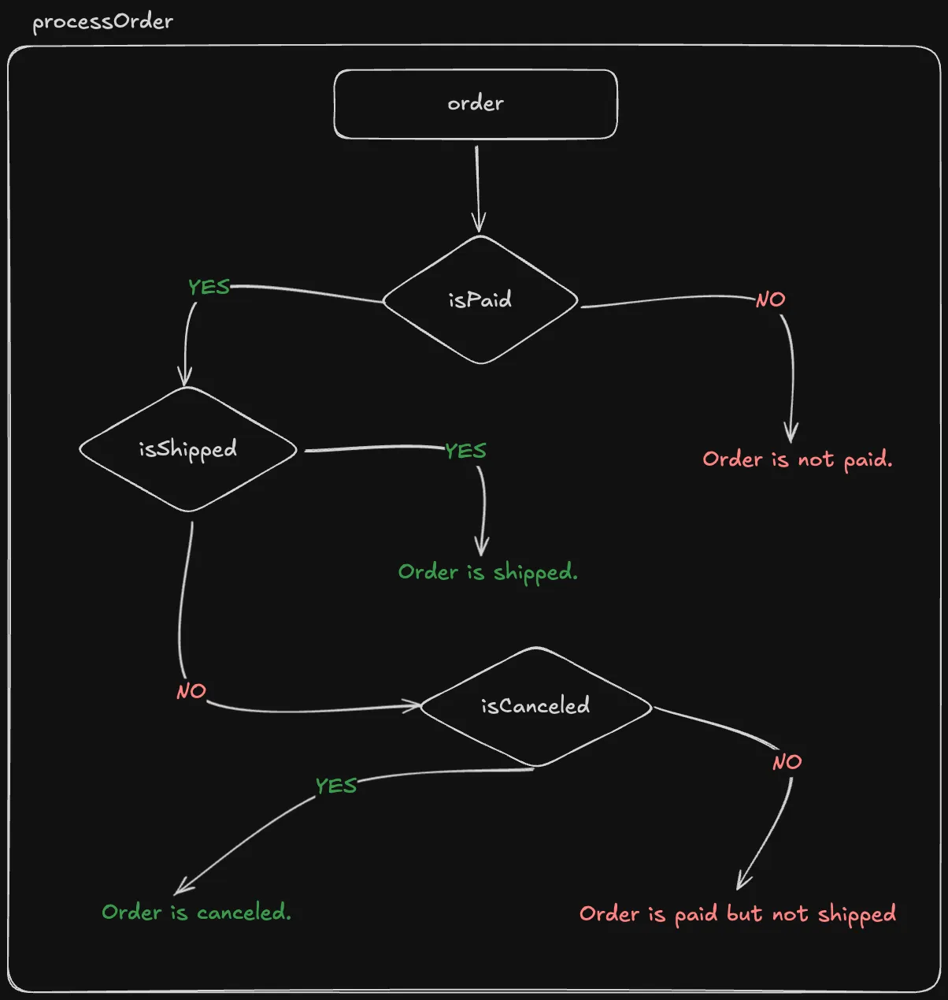

import { Callout } from '@/components/MarkdownComponents';

# Solution

<iframe
  width='100%'
  style={{
    aspectRatio: '16 / 9',
  }}
  src='https://www.youtube.com/embed/jO4SmCMM87g?'
  title='Refactor: Early Returns - 1 | JavaScript Coding | Easy Practice Question'
  frameBorder='0'
  allow='accelerometer; autoplay; clipboard-write; encrypted-media; gyroscope; picture-in-picture; web-share'
  allowFullScreen
/>

It is always a good idea to write the tests first to lock the current behavior before refactoring.

Before we write our test cases, let us try to understand the flow of code in our existing code. Using a diagramming tool like [Excalidraw](https://excalidraw.com/) or even a pen and paper can greatly help us understand the flow of code.



<Callout type='error'>
You might be very tempted to rewrite the code differently. Even before you do that, it is always a good idea to write the tests first or at least the control flow diagram to lock the current behavior before refactoring. In actual production, the code will be more complex than what we have here.
</Callout>

## Tests

Based on the question, let us write the test cases for the following scenarios with the control flow diagram in mind.:

### The order is not paid.

```js title="index.test.js"
test('order is not paid', () => {
  expect(processOrder({ isPaid: false })).toBe('Order is not paid.');
});
```

### The order is paid but not shipped.

```js title="index.test.js"
test('order is paid but not shipped', () => {
  expect(processOrder({ isPaid: true, isShipped: false, isCanceled: false })).toBe(
    'Order is paid but not shipped.',
  );

  expect(processOrder({ isPaid: true, isShipped: false })).toBe(
    'Order is paid but not shipped.',
  );
});
```

### The order is shipped.

```js title="index.test.js"
test('order is shipped', () => {
  expect(processOrder({ isPaid: true, isShipped: true })).toBe(
    'Order is shipped.',
  );

  expect(processOrder({ isPaid: true, isShipped: true, isCanceled: true })).toBe(
    'Order is shipped.',
  );

  expect(processOrder({ isPaid: true, isShipped: true, isCanceled: false })).toBe(
    'Order is shipped.',
  );
});
```

### The order is canceled.

```js title="index.test.js"
test('order is canceled', () => {
  expect(processOrder({ isPaid: true, isShipped: false, isCanceled: true })).toBe(
    'Order is canceled.',
  );
});
```

## Refactoring

Now that the tests have locked the current behavior, let us refactor the code safely.

Given this is a small function, we can pretty much rewrite it with the help of the control flow diagram and tests.

```js title="index.js"
/**
 * Processes an order based on its payment and shipping status.
 *
 * @param {{isPaid: boolean, isShipped?: boolean, isCanceled?: boolean}} order - An object representing the order, with boolean properties 'isPaid', 'isShipped', and 'isCanceled'.
 * @return {string} A message describing the order's status.
 */
export function processOrder(order) {}
```

This should make all the tests fail. We can start writing the code to implement early returns and pass the tests.

Let us work on the early return if order is not paid:

```js title="index.js"
// The rest of the code was omitted for brevity
export function processOrder(order) {
  // [!code ++:4]
  if (!order.isPaid) {
    return 'Order is not paid.';
  }
}
```

We simply return early if the order is not paid. This code should pass the test `order is not paid`.

Next, looking at our control flow diagram, we can implement another early return if order is shipped:

```js title="index.js"
// The rest of the code was omitted for brevity
export function processOrder(order) {
  if (!order.isPaid) {
    return 'Order is not paid.';
  }

  // [!code ++:4]
  if (order.isShipped) {
    return 'Order is shipped.';
  }
}
```

Another early return and we do not have to explicitly check if the order is paid since that is implied by the first early return. This should pass another test `order is shipped`.

Now, looking at our control flow diagram, we can implement another early return if order is canceled:

```js title="index.js"
// The rest of the code was omitted for brevity
export function processOrder(order) {
  if (!order.isPaid) {
    return 'Order is not paid.';
  }

  if (order.isShipped) {
    return 'Order is shipped.';
  }

  // [!code ++:4]
  if (order.isCanceled) {
    return 'Order is canceled.';
  }
}
```

We do not have to explicitly check if the order is paid or shipped since that is implied by the first two early returns. This should pass the last test `order is canceled`.

The only remaining early return is if the order is paid but not shipped. 

```js title="index.js"
// The rest of the code was omitted for brevity
export function processOrder(order) {
  if (!order.isPaid) {
    return 'Order is not paid.';
  }

  if (order.isShipped) {
    return 'Order is shipped.';
  }

  if (order.isCanceled) {
    return 'Order is canceled.';
  }

  return 'Order is paid but not shipped.'; // [!code ++]
}
```


Since we do not have any more checks to perform, a direct return is sufficient. This should pass the last test `order is paid but not shipped`.

All the tests should now pass.

Compare this refactored version to our original code. The refactored version is much more readable and maintainable.

## Full Code

```js title="index.test.js"
import { describe, test, expect } from 'vitest';

import { processOrder } from '.';

describe('refactor-early-returns-1', () => {
  test('order is not paid', () => {
    expect(processOrder({ isPaid: false })).toBe('Order is not paid.');
  });

  test('order is paid but not shipped', () => {
    expect(processOrder({ isPaid: true, isShipped: false, isCanceled: false })).toBe(
      'Order is paid but not shipped.',
    );

    expect(processOrder({ isPaid: true, isShipped: false })).toBe(
      'Order is paid but not shipped.',
    );
  });

  test('order is shipped', () => {
    expect(processOrder({ isPaid: true, isShipped: true })).toBe(
      'Order is shipped.',
    );

    expect(processOrder({ isPaid: true, isShipped: true, isCanceled: true })).toBe(
      'Order is shipped.',
    );

    expect(processOrder({ isPaid: true, isShipped: true, isCanceled: false })).toBe(
      'Order is shipped.',
    );
  });

  test('order is canceled', () => {
    expect(processOrder({ isPaid: true, isShipped: false, isCanceled: true })).toBe(
      'Order is canceled.',
    );
  });
});
```

```js title="index.js"
/**
 * Processes an order based on its payment and shipping status.
 *
 * @param {{isPaid: boolean, isShipped?: boolean, isCanceled?: boolean}} order - An object representing the order, with boolean properties 'isPaid', 'isShipped', and 'isCanceled'.
 * @return {string} A message describing the order's status.
 */
export function processOrder(order) {
  if (!order.isPaid) {
    return 'Order is not paid.';
  }

  if (order.isShipped) {
    return 'Order is shipped.';
  }

  if (order.isCanceled) {
    return 'Order is canceled.';
  }

  return 'Order is paid but not shipped.';
}
```