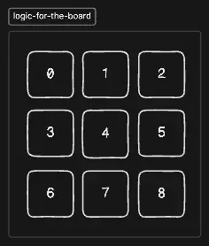

import { Callout } from '@/components/MarkdownComponents';

# Solution

<Callout type='warning'>
Even before you start writing the code, grab a pen and paper or a drawing tool and think of the implementation.

In fact, if asked in an interview, even if you know the solution do not rush! You have to talk the approach you are going to take with the interviewer. Do not be robotic!
</Callout>

## Approach

 

Representing our board in an array seems the simplest.

This way representing the win conditions is as simple as the below:

```javascript title="index.js"
const winningConditions = [
  [0, 1, 2], // Rows
  [3, 4, 5],
  [6, 7, 8], 
  [0, 3, 6], // Columns
  [1, 4, 7],
  [2, 5, 8], 
  [0, 4, 8], // Diagonals
  [2, 4, 6], 
];
```

Okay, what about the actual game state?

Given each of these cells can only be either "X" or "O", we can also store the entire game state in a single variable `gameState` with 9 empty (string) cells:

```javascript title="index.js"
const gameState = ['', '', '', '', '', '', '', '', ''];
```

Meaning after each turn we can have a function `checkResult` that will check these two variables to identify the game.

Of course, we will use more helper variables to understand the game's active state, current player state, etc ., but we will do that on the fly as needed.

Let us get into the actual code now!

<Callout>
There are various ways to solve this question. This is just one of them and not the only way to solve it.
</Callout>

## Basic HTML Markup

Let us work on the game container that would include the following:

- A turn indicator
- The game board
- A start button
- A restart button

That means the body of the HTML would look something like this:

```html title="index.html" {2-8}
<body>
  <div class="game-container">
    <h1>Tic-Tac-Toe</h1>
    <div id="turn-indicator"></div>
    <div class="game-board" id="game-board"></div>
    <button id="start-btn">Start Game</button>
    <button id="restart-btn">Restart Game</button>
  </div>
  
  <script src="index.js"></script>
</body>
```

Creating the game board is best done using JavaScript instead of trying to create the markup here!

We have also given IDs for the elements that need to be accessed later with JavaScript.

## Creating the Board

We can create a function that will create the board.

```javascript title="index.js"
const board = document.getElementById('game-board');

function createBoard() {
  for (let i = 0; i < 9; i++) {
    const cell = document.createElement('div');
    cell.classList.add('cell');
    cell.setAttribute('data-index', i);
    cell.addEventListener('click', handleCellClick);
    board.appendChild(cell);
  }
}
```

We get the HTML element for the board and store it in an obvious variable `board`.

Then we create a function `createBoard` that will generate the individual cells needed. We do not have to make this accept any parameters like number of cells for this game, as we are only required to work with a 3x3 board.

We add a couple of things to this cell such as:

- A class name `cell` 
- An attribute `data-index` to uniquely identify the cell.
- An event listener for click events `handleCellClick`, we will implement it soon.

Then we just append these cells to the board!

Finally, we call the function to create board.

```javascript title="index.js" {13}
const board = document.getElementById('game-board');

function createBoard() {
  for (let i = 0; i < 9; i++) {
    const cell = document.createElement('div');
    cell.classList.add('cell');
    cell.setAttribute('data-index', i);
    cell.addEventListener('click', handleCellClick);
    board.appendChild(cell);
  }
}

createBoard();
```

But nothing happens? If you check the browser console (not the platform's console). You will see an error that `handleCellClick` is not defined.

For now, we will just create an empty function to get rid of the error.

```javascript title="index.js"
const board = document.getElementById('game-board');

function createBoard() {
  // Omitted for brevity
}

function handleCellClick() {}

createBoard();
```

We still cannot see anything! Well, inspect the document and you will see the cells. The reason we cannot see anything is because these cells are empty.

Let us add the index as text to these cells to help us better develop the game.

```javascript title="index.js" {6}
const board = document.getElementById('game-board');

function createBoard() {
  for (let i = 0; i < 9; i++) {
    const cell = document.createElement('div');
    cell.textContent = i;
    cell.classList.add('cell');
    cell.setAttribute('data-index', i);
    cell.addEventListener('click', handleCellClick);
    board.appendChild(cell);
  }
}

function handleCellClick() {}

createBoard();
```

Great, we can see the cells but not exactly in a 3x3 format. We can fix that using CSS or doing something like the below:

```html
<div>
  <div>Row 1</div>
  <div>Row 2</div>
  <div>Row 3</div>
</div>
```

But this is not recommended because we have a more 1-D way of representing our game state. So, doing this with CSS is better, the code to style them into 3x3 format would look like this:

```css title="styles.css"
body {
  font-family: Arial, sans-serif;
  display: flex;
  justify-content: center;
  align-items: center;
  height: 100vh;
  margin: 0;
  background-color: #f0f0f0;
}

.game-container {
  text-align: center;
}

.game-board {
  display: grid;
  grid-template-columns: repeat(3, 100px);
  grid-gap: 5px;
  margin-bottom: 20px;
}

.cell {
  width: 100px;
  height: 100px;
  background-color: #fff;
  border: 2px solid #333;
  font-size: 2em;
  display: flex;
  justify-content: center;
  align-items: center;
  cursor: pointer;
}
```

The `display: grid;` and `grid-template-columns: repeat(3, 100px);` is what makes the most of the magic of the 3x3 layout.

With this CSS styling, we do not have to touch more styles and just focus on the game logic.

## Starting and Restarting the Game

Let us also save the element references for the start and restart buttons.

```javascript title="index.js"
const startBtn = document.getElementById('start-btn');
const restartBtn = document.getElementById('restart-btn');
```

Let us also create a function to start the game.

```javascript title="index.js"
function startGame() {}
```

Now, what should this function essentially do? It should:

- Update the game's active status to true.
- Make the current player to be `X` and update the turn indicator.
- Make sure the game state is the initial empty state.
We can essentially also use the same function to restart the game, if we just call the `createBoard` function along with the above updates. Let us do that too.

```javascript title="index.js" showLineNumbers {2-4, 6-8, 23-25, 27-33, 35-36, 38}
const board = document.getElementById('game-board');
const turnIndicator = document.getElementById('turn-indicator');
const startBtn = document.getElementById('start-btn');
const restartBtn = document.getElementById('restart-btn');

let currentPlayer = 'X';
let gameState = ['', '', '', '', '', '', '', '', ''];
let gameActive = false;

function createBoard() {
  for (let i = 0; i < 9; i++) {
    const cell = document.createElement('div');
    cell.textContent = i;
    cell.classList.add('cell');
    cell.setAttribute('data-index', i);
    cell.addEventListener('click', handleCellClick);
    board.appendChild(cell);
  }
}

function handleCellClick() {}

function updateTurnIndicator() {
  turnIndicator.textContent = `Player ${currentPlayer}'s turn`;
}

function startGame() {
  gameActive = true;
  currentPlayer = 'X';
  gameState = ['', '', '', '', '', '', '', '', ''];
  updateTurnIndicator();
  createBoard();
}

startBtn.addEventListener('click', startGame);
restartBtn.addEventListener('click', startGame);

createBoard();
turnIndicator.textContent = 'Press "Start Game" to begin';
```

Now, if we click on start we immediately see the turn indicator update but another board is also created!

This seems to be a bug because our `startGame` implementation creates a new board every time you either click `start` or `restart`.

Though you might be tempted to remove the `createBoard` call from the `startGame` function. The easier and better fix is to make sure that before the board is created there is no board.

```javascript title="index.js" {2}
function createBoard() {
  board.innerHTML = ''; // makes sure that only one board is ever created
  
  for (let i = 0; i < 9; i++) {
    const cell = document.createElement('div');
    cell.textContent = i;
    cell.classList.add('cell');
    cell.setAttribute('data-index', i);
    cell.addEventListener('click', handleCellClick);
    board.appendChild(cell);
  }
}
```

Perfect! Now let us handle the clicking of the cells.

```javascript title="index.js"
function handleCellClick(e) {
  const clickedCell = e.target;
  const cellIndex = parseInt(clickedCell.getAttribute('data-index'));

  if (gameState[cellIndex] !== '' || !gameActive) return;

  gameState[cellIndex] = currentPlayer;
  clickedCell.textContent = currentPlayer;
}
```

We get the target element and the index of the cell using our `data-index` attribute.

Then we simply check whether the game is active and that the cell is not already filled otherwise we simply return instead of overwriting the cell content or creating a weird game state.

But where do we update the current player? The better question to ask is "Is this the right time to also check the game result?"

Yes! Checking the game result right after the current player's move is the way to proceed here and then we can think of updating the current player or deciding the winner or draw state.

```javascript title="index.js" {10}
function handleCellClick(e) {
  const clickedCell = e.target;
  const cellIndex = parseInt(clickedCell.getAttribute('data-index'));

  if (gameState[cellIndex] !== '' || !gameActive) return;

  gameState[cellIndex] = currentPlayer;
  clickedCell.textContent = currentPlayer;
  
  checkResult();
}
```

Let us implement the `checkResult` function now.

```javascript title="index.js"
const winningConditions = [
  [0, 1, 2], // Rows
  [3, 4, 5],
  [6, 7, 8], 
  [0, 3, 6], // Columns
  [1, 4, 7],
  [2, 5, 8], 
  [0, 4, 8], // Diagonals
  [2, 4, 6], 
];

function checkResult() {
  let roundWon = false;

  for (let i = 0; i < winningConditions.length; i++) {
    const [a, b, c] = winningConditions[i];
    if (
      gameState[a] &&
      gameState[a] === gameState[b] &&
      gameState[a] === gameState[c]
    ) {
      roundWon = true;
      break;
    }
  }

  if (roundWon) {
    turnIndicator.textContent = `Player ${currentPlayer} wins!`;
    gameActive = false;
    return;
  }

  if (!gameState.includes('')) {
    turnIndicator.textContent = "It's a draw!";
    gameActive = false;
    return;
  }

  currentPlayer = currentPlayer === 'X' ? 'O' : 'X';
  updateTurnIndicator();
}
```

After every valid cell click, we check if the winning condition is met. We simply loop through our `winningConditions` and check the `gameState`. We do not have to worry about the `currentPlayer` value in this condition because if all three cells are the same, then we can break out of the loop and return the `currentPlayer` value as the winner.

The draw condition is simple too! If there are no more empty strings in the `gameState` and the winner is not found, it is a draw!

After these checks, we can then update the `currentPlayer` to the next player and also update the turn indicator.

<Callout>
Of course, we could have moved the logic for player update into `updateTurnIndicator` or maybe created another function `updateTurn`. The reason we did not do it is because in an interview there really won't be much time to refactor, if the interviewer also wants to improve the code readability then go ahead and do such a refactoring! Otherwise, the code such as above will work!
</Callout>

<Callout type="warning">
We can get a bit smart here and try to optimize for checking the result only after a minimum number of moves needed to achieve a win are made. In our opinion, it is premature optimization and there is no real performance gain from doing so! But you could put this out for the interviewer! They might be impressed.
</Callout>

With the `checkResult` function complete, our game can now be played! You can remove the following line we added for development purpose:

```javascript title="index.js"
cell.textContent = i;
```

## Final Code

```html title="index.html"
<!doctype html>
<html>
  <head>
    <title>FH: Tic-Tac-Toe</title>
    <meta charset="UTF-8" />
    <!-- IF LOCAL: <link rel="stylesheet" href="styles.css" /> -->
    <link rel="stylesheet" href="/styles.css" /> 
  </head>

  <body>
    <div class="game-container">
      <h1>Tic-Tac-Toe</h1>
      <div id="turn-indicator"></div>
      <div class="game-board" id="game-board"></div>
      <button id="start-btn">Start Game</button>
      <button id="restart-btn">Restart Game</button>
    </div>

    <script src="index.js"></script>
  </body>
</html>
```

```css title="styles.css"
body {
  font-family: Arial, sans-serif;
  display: flex;
  justify-content: center;
  align-items: center;
  height: 100vh;
  margin: 0;
  background-color: #f0f0f0;
}

.game-container {
  text-align: center;
}

.game-board {
  display: grid;
  grid-template-columns: repeat(3, 100px);
  grid-gap: 5px;
  margin-bottom: 20px;
}

.cell {
  width: 100px;
  height: 100px;
  background-color: #fff;
  border: 2px solid #333;
  font-size: 2em;
  display: flex;
  justify-content: center;
  align-items: center;
  cursor: pointer;
}
```

```javascript title="index.js"
const board = document.getElementById('game-board');
const turnIndicator = document.getElementById('turn-indicator');
const startBtn = document.getElementById('start-btn');
const restartBtn = document.getElementById('restart-btn');

const winningConditions = [
  [0, 1, 2], // Rows
  [3, 4, 5],
  [6, 7, 8], 
  [0, 3, 6], // Columns
  [1, 4, 7],
  [2, 5, 8], 
  [0, 4, 8], // Diagonals
  [2, 4, 6], 
];

let currentPlayer = 'X';
let gameState = ['', '', '', '', '', '', '', '', ''];
let gameActive = false;

function createBoard() {
  board.innerHTML = '';

  for (let i = 0; i < 9; i++) {
    const cell = document.createElement('div');
    cell.classList.add('cell');
    cell.setAttribute('data-index', i);
    cell.addEventListener('click', handleCellClick);
    board.appendChild(cell);
  }
}

function handleCellClick(e) {
  const clickedCell = e.target;
  const cellIndex = parseInt(clickedCell.getAttribute('data-index'));

  if (gameState[cellIndex] !== '' || !gameActive) return;

  gameState[cellIndex] = currentPlayer;
  clickedCell.textContent = currentPlayer;

  checkResult();
}

function checkResult() {
  let roundWon = false;

  for (let i = 0; i < winningConditions.length; i++) {
    const [a, b, c] = winningConditions[i];
    if (
      gameState[a] &&
      gameState[a] === gameState[b] &&
      gameState[a] === gameState[c]
    ) {
      roundWon = true;
      break;
    }
  }

  if (roundWon) {
    turnIndicator.textContent = `Player ${currentPlayer} wins!`;
    gameActive = false;
    return;
  }

  if (!gameState.includes('')) {
    turnIndicator.textContent = "It's a draw!";
    gameActive = false;
    return;
  }

  currentPlayer = currentPlayer === 'X' ? 'O' : 'X';
  updateTurnIndicator();
}

function updateTurnIndicator() {
  turnIndicator.textContent = `Player ${currentPlayer}'s turn`;
}

function startGame() {
  gameActive = true;
  currentPlayer = 'X';
  gameState = ['', '', '', '', '', '', '', '', ''];
  updateTurnIndicator();
  createBoard();
}

startBtn.addEventListener('click', startGame);
restartBtn.addEventListener('click', startGame);

createBoard();
turnIndicator.textContent = 'Press "Start Game" to begin';
```