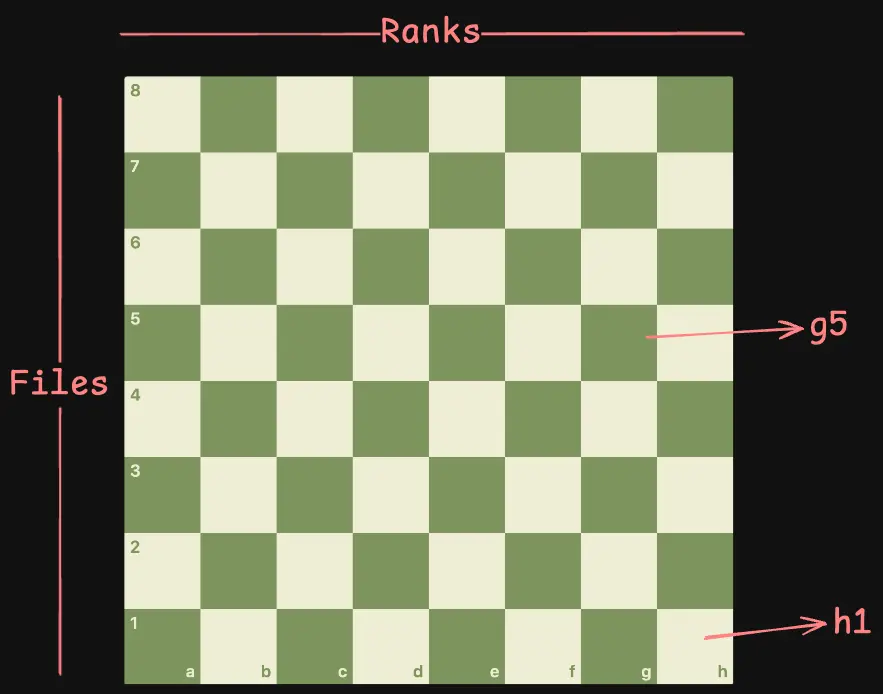

# Chess Board - 1

A common interview question that requires you to implement a React component that renders a chess board.

>  Why did the React developer lose at chess? They kept trying to setState before checking mate! 

## Objective

Render a proper 8x8 chess board as shown below.

## Requirements

- The board should be 8x8
- There should be chess labels for the ranks and files
- Ranks are rows and files are columns
- Ranks are numbered from **"1 to 8" **and files are from **"a to h"**
- The squares on the board should alternate colors with the lightest color on the top left corner
- Clicking the square should change the color to red and display the rank and file on the square in a contrasting (visible) color

### Helpers

- Light Color: #ebecd0
- Dark Color: #739552
- Highlight Color: #ff0032
- Hightlight Text Color: #ffffff
- Square Size: 3rem X 3rem

## Resources to Refer

- [Chess.com: Chess Board](https://www.chess.com/terms/chessboard) 
