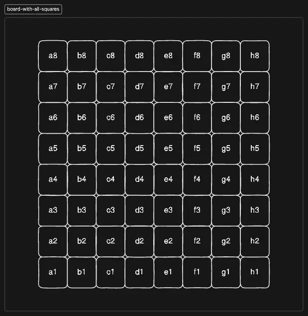

import { Callout } from '@/components/MarkdownComponents';

# Solution

<Callout>
There are a lot of ways to solve this problem. In real world, using a well known library like [chessboard.js](https://chessboardjs.com/) is recommended. The below solution is one of the ways to solve this problem.
</Callout>

<Callout type="warning"> 
Do not rush into the solution. If you are not familiar with the domain of chess, it is completely fine and the interviewer is there to help you with the requirements. So, try to understand the basic terms and concepts before writing the code. 
</Callout>

Let us first set up some constants.

```js title="constants.js" showLineNumbers
export const RANKS = '12345678'.split('');

export const FILES = 'abcdefgh'.split('');

export const COLORS = {
  lightSquare: '#ebecd0',
  darkSquare: '#739552',
  highlight: '#ff0032',
  highlightText: '#ffffff',
};

export const SQUARE_SIZE = '3rem';
```

Now, let us work on the `ChessBoard` component. 

But how do we best represent the board? Do we use CSS to render the board or maybe use just HTML markup to render the board?

What if we represent the board as a 2D array and store the data regarding individual squares as an object? This way our logic would not be tied to CSS or HTML, both of which could get quite flaky.

```js title="ChessBoard.js" showLineNumbers {1-5}
function createBoard() {
  const board = [];

  return board;
}

export default function ChessBoard() {
  return null;
}
```

So, we need to get the following 2D structure:

 

```js title="ChessBoard.js" showLineNumbers {1, 6-16}
import { FILES, RANKS } from './constants';

function createBoard() {
  const board = [];

  RANKS.forEach((rankLabel) => {
    const file = [];
    FILES.forEach((fileLabel) => {
      file.push({
        file: fileLabel,
        rank: rankLabel,
      });
    });

    board.push(file);
  });

  return board;
}

export default function ChessBoard() {
  return null;
}
```

Hmm, this is nice but what about the color? 

We can use the indices of ranks and files to compute that!

```js title="ChessBoard.js" showLineNumbers {1, 12-13}
import { COLORS, FILES, RANKS } from './constants';

function createBoard() {
  const board = [];

  RANKS.forEach((rankLabel, rankLabelIdx) => {
    const file = [];
    FILES.forEach((fileLabel, fileLabelIdx) => {
      file.push({
        file: fileLabel,
        rank: rankLabel,
        color:
          (fileLabelIdx + rankLabelIdx) % 2 === 0 ? COLORS.lightSquare : COLORS.darkSquare,
      });
    });

    board.push(file);
  });

  return board;
}

export default function ChessBoard() {
  return null;
}
```

Let us create the board and log it to the console!

```js title="ChessBoard.js" showLineNumbers {23-25}
import { COLORS, FILES, RANKS } from './constants';

function createBoard() {
  const board = [];

  RANKS.forEach((rankLabel, rankLabelIdx) => {
    const file = [];
    FILES.forEach((fileLabel, fileLabelIdx) => {
      file.push({
        file: fileLabel,
        rank: rankLabel,
        color:
          (fileLabelIdx + rankLabelIdx) % 2 === 0 ? COLORS.lightSquare : COLORS.darkSquare,
      });
    });

    board.push(file);
  });

  return board;
}

const BOARD = createBoard();

console.log(BOARD);

export default function ChessBoard() {
  return null;
}
```

Hmm, our board is not correct!

```js
[
    [
        {
            "file": "a",
            "rank": "1",
            "color": "#ebecd0"
        },
        {
            "file": "b",
            "rank": "1",
            "color": "#739552"
        },
        {
            "file": "c",
            "rank": "1",
            "color": "#ebecd0"
        },
        {
            "file": "d",
            "rank": "1",
            "color": "#739552"
        },
        {
            "file": "e",
            "rank": "1",
            "color": "#ebecd0"
        },
        {
            "file": "f",
            "rank": "1",
            "color": "#739552"
        },
        {
            "file": "g",
            "rank": "1",
            "color": "#ebecd0"
        },
        {
            "file": "h",
            "rank": "1",
            "color": "#739552"
        }
    ],
    [
        // Omitted for brevity
    ],
    [
        // Omitted for brevity
    ],
    [
        {
            "file": "a",
            "rank": "8",
            "color": "#739552"
        },
        {
            "file": "b",
            "rank": "8",
            "color": "#ebecd0"
        },
        {
            "file": "c",
            "rank": "8",
            "color": "#739552"
        },
        {
            "file": "d",
            "rank": "8",
            "color": "#ebecd0"
        },
        {
            "file": "e",
            "rank": "8",
            "color": "#739552"
        },
        {
            "file": "f",
            "rank": "8",
            "color": "#ebecd0"
        },
        {
            "file": "g",
            "rank": "8",
            "color": "#739552"
        },
        {
            "file": "h",
            "rank": "8",
            "color": "#ebecd0"
        }
    ]
]
```

We need to reverse the ranks since the top left square which is our starting point is 8th rank.

```js title="ChessBoard.js" showLineNumbers {6}
import { COLORS, FILES, RANKS } from './constants';

function createBoard() {
  const board = [];

  RANKS.reverse().forEach((rankLabel, rankLabelIdx) => {
    const file = [];
    FILES.forEach((fileLabel, fileLabelIdx) => {
      file.push({
        file: fileLabel,
        rank: rankLabel,
        color:
          (fileLabelIdx + rankLabelIdx) % 2 === 0
            ? COLORS.lightSquare
            : COLORS.darkSquare,
      });
    });

    board.push(file);
  });

  return board;
}

const BOARD = createBoard();

console.log(BOARD);

export default function ChessBoard() {
  return null;
}
```

Perfect! Now our board is correctly represented. 

Let us get to rendering the actual board on screen.

```js title="ChessBoard.js" showLineNumbers {10-22}
import { COLORS, FILES, RANKS } from './constants';

function createBoard() {
  // Omitted for brevity
}

const BOARD = createBoard();

export default function ChessBoard() {
  return (
    <div>
      {BOARD.map((rank) => (
        <div className="flex" key={rank[0].rank}>
          {rank.map((square) => (
            <div key={square.file + square.rank}>
              {square.file + square.rank}
            </div>
          ))}
        </div>
      ))}
    </div>
  );
}
```

Let us add some styles!

```js title="ChessBoard.js" showLineNumbers {1, 13-17}
import { COLORS, FILES, RANKS, SQUARE_SIZE } from './constants';

// The rest of the code omitted for brevity

export default function ChessBoard() {
  return (
    <div>
      {BOARD.map((rank) => (
        <div className="flex" key={rank[0].rank}>
          {rank.map((square) => (
            <div
              key={square.file + square.rank}
              style={{
                backgroundColor: square.color,
                width: SQUARE_SIZE,
                height: SQUARE_SIZE,
              }}
            >
              {square.file + square.rank}
            </div>
          ))}
        </div>
      ))}
    </div>
  );
}
```

Great, the board is taking shape. Let us abstract out the square presentation logic to a different component.

```js title="ChessBoard.js" showLineNumbers {3-15, 23-28}
// The rest of the code omitted for brevity

function Square({ file, rank, color }) {
  return (
    <div
      style={{
        backgroundColor: color,
        width: SQUARE_SIZE,
        height: SQUARE_SIZE,
      }}
    >
      {file + rank}
    </div>
  );
}

export default function ChessBoard() {
  return (
    <div>
      {BOARD.map((rank) => (
        <div className="flex" key={rank[0].rank}>
          {rank.map((square) => (
            <Square
              key={square.file + square.rank}
              file={square.file}
              rank={square.rank}
              color={square.color}
            />
          ))}
        </div>
      ))}
    </div>
  );
}
```

Great, let us now work on highlighting the square and displaying the file and rank of the highlighted square.

```js title="ChessBoard.js" showLineNumbers {1, 5, 8,10, 15-20, 26-29, 41-45}
import React from 'react';

// The rest of the code omitted for brevity

function Square({ file, rank, color, isHighlighted, onClick }) {
  return (
    <div
      onClick={onClick}
      style={{
        backgroundColor: `${isHighlighted ? COLORS.highlight : color}`,
        width: SQUARE_SIZE,
        height: SQUARE_SIZE,
      }}
    >
      {isHighlighted && (
        <p className="text-sm" style={{ color: COLORS.highlightText }}>
          {file}
          {rank}
        </p>
      )}
    </div>
  );
}

export default function ChessBoard() {
  const [highlightedSquare, setHighlightedSquare] = React.useState({
    file: '',
    rank: '',
  });

  return (
    <div>
      {BOARD.map((rank) => (
        <div className="flex" key={rank[0].rank}>
          {rank.map((square) => (
            <Square
              key={square.file + square.rank}
              file={square.file}
              rank={square.rank}
              color={square.color}
              isHighlighted={
                square.file + square.rank ===
                highlightedSquare.file + highlightedSquare.rank
              }
              onClick={() => setHighlightedSquare(square)}
            />
          ))}
        </div>
      ))}
    </div>
  );
}
```

Perfect! Now how do we add the labels for ranks and files?

We could separate components but overlaying them on top of the board would be a mess due to positioning and z-indexes.

Instead, we can let the `Square` component handle it.

```js title="ChessBoard.js" showLineNumbers {1, 22-37}
import { getAlternateColor } from './utils';

// The rest of the code omitted for brevity

function Square({ file, rank, color, isHighlighted, onClick }) {
  return (
    <div
      onClick={onClick}
      className="relative"
      style={{
        backgroundColor: `${isHighlighted ? COLORS.highlight : color}`,
        width: SQUARE_SIZE,
        height: SQUARE_SIZE,
      }}
    >
      {isHighlighted && (
        <p className="text-sm" style={{ color: COLORS.highlightText }}>
          {file}
          {rank}
        </p>
      )}
      {!isHighlighted && file === 'a' && (
        <span
          style={{ color: getAlternateColor(color) }}
          className="pointer-events-none absolute left-0 top-0 select-none p-0.5 text-xs"
        >
          {rank}
        </span>
      )}
      {!isHighlighted && rank === '1' && (
        <span
          style={{ color: getAlternateColor(color) }}
          className="pointer-events-none absolute bottom-0 right-0 select-none p-0.5 text-xs"
        >
          {file}
        </span>
      )}
    </div>
  );
}

// The rest of the code omitted for brevity
```

We create a utility function to get the alternate color for the labels.

```js title="utils.js" showLineNumbers
import { COLORS } from './constants';

export function getAlternateColor(color: string) {
  return color === COLORS.lightSquare ? COLORS.darkSquare : COLORS.lightSquare;
}
```

We only use the first rank and first file to render the labels and disable pointer events and text selection on them. We also add make the parent `relative` for a better position of these labels.

With this, our chessboard should be ready!

## Final Code

```js title="ChessBoard.js" showLineNumbers
import React from 'react';
import { getAlternateColor } from './utils';
import { COLORS, FILES, RANKS, SQUARE_SIZE } from './constants';

function createBoard() {
  const board = [];

  RANKS.reverse().forEach((rankLabel, rankLabelIdx) => {
    const file = [];
    FILES.forEach((fileLabel, fileLabelIdx) => {
      file.push({
        file: fileLabel,
        rank: rankLabel,
        color:
          (fileLabelIdx + rankLabelIdx) % 2 === 0
            ? COLORS.lightSquare
            : COLORS.darkSquare,
      });
    });

    board.push(file);
  });

  return board;
}

const BOARD = createBoard();

function Square({ file, rank, color, isHighlighted, onClick }) {
  return (
    <div
      onClick={onClick}
      className="relative"
      style={{
        backgroundColor: `${isHighlighted ? COLORS.highlight : color}`,
        width: SQUARE_SIZE,
        height: SQUARE_SIZE,
      }}
    >
      {isHighlighted && (
        <p className="text-sm" style={{ color: COLORS.highlightText }}>
          {file}
          {rank}
        </p>
      )}
      {!isHighlighted && file === 'a' && (
        <span
          style={{ color: getAlternateColor(color) }}
          className="pointer-events-none absolute left-0 top-0 select-none p-0.5 text-xs"
        >
          {rank}
        </span>
      )}
      {!isHighlighted && rank === '1' && (
        <span
          style={{ color: getAlternateColor(color) }}
          className="pointer-events-none absolute bottom-0 right-0 select-none p-0.5 text-xs"
        >
          {file}
        </span>
      )}
    </div>
  );
}

export default function ChessBoard() {
  const [highlightedSquare, setHighlightedSquare] = React.useState({
    file: '',
    rank: '',
  });

  return (
    <div>
      {BOARD.map((rank) => (
        <div className="flex" key={rank[0].rank}>
          {rank.map((square) => (
            <Square
              key={square.file + square.rank}
              file={square.file}
              rank={square.rank}
              color={square.color}
              isHighlighted={
                square.file + square.rank ===
                highlightedSquare.file + highlightedSquare.rank
              }
              onClick={() => setHighlightedSquare(square)}
            />
          ))}
        </div>
      ))}
    </div>
  );
}
```

```js title="utils.js" showLineNumbers
import { COLORS } from './constants';

export function getAlternateColor(color) {
  return color === COLORS.lightSquare ? COLORS.darkSquare : COLORS.lightSquare;
}
```

```js title="constants.js" showLineNumbers
export const RANKS = '12345678'.split('');

export const FILES = 'abcdefgh'.split('');

export const COLORS = {
  lightSquare: '#ebecd0',
  darkSquare: '#739552',
  highlight: '#ff0032',
  highlightText: '#ffffff',
};

export const SQUARE_SIZE = '3rem';
```