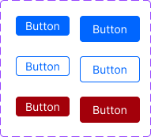

# Design System: Buttons - 1

There are various ways to create a design system. Using CVA (class variance authority) is one of them.

> Why did the button refuse to join the design system?
> Because it said it didn't want to be "contained" and preferred to "stand out"!

### Objective
A designer has given you a set of basic button components that would be used across your application. You will need to create a button component that can be used to create different types of buttons, such as Primary, Outline, and Destructive buttons. You will also need to create different sizes for each button type (e.g., Small, Medium).

### Requirements
- Implement various button types, such as Primary, Outline, and Destructive buttons as per this [Figma Design](https://www.figma.com/design/Ftlq57HgzjG65XqolsFXSg/Frontend-Hire-Questions?node-id=24-2&t=7avBne1k9a3gBJQw-1).
- Include different sizes for each button type (e.g., Small, Medium).
- You can use either CSS Modules or TailwindCSS to implement the design.
- Do not worry about Icons for this task.

### External Dependencies Versions Used 

If these dependencies are updated, kindly check the docs of the below versions for this question.

- [class-variance-authority](https://cva.style/docs): **0.7.0**
- [tailwind-merge](https://github.com/dcastil/tailwind-merge): **1.14.0**
- [clsx](https://github.com/lukeed/clsx): **2.0.0**

### Design Reference

If you do not want to use Figma, you can use this image as a reference:

### Resources to Refer
- [Class Variance Authority](https://cva.style/docs)
- [CVA: React with CSS Modules](https://cva.style/docs/examples/react/css-modules)
- [CVA: React with TailwindCSS](https://cva.style/docs/examples/react/tailwind-css)
